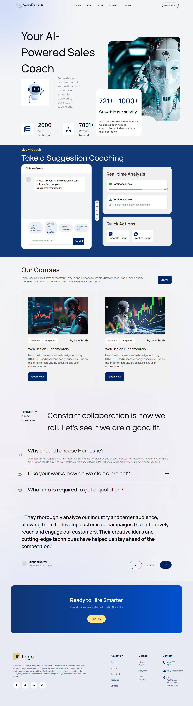

# AI Coach

- AI Coach is a web-based application designed to provide users with personalized coaching experiences using AI technologies. Built with React and Vite, this project offers a fast and responsive user interface, ensuring seamless interactions and real-time feedback.

## Features

-React + Vite Integration: Utilizes Vite for rapid development and optimized builds.

-ESLint Configuration: Ensures code quality and consistency across the project.

## Live Link

- Deployed on Vercel: [ai-coach-iota.vercel.app](https://ai-coach-iota.vercel.app/)

## Project Structure

```
ai-coach/
├── public/
│   └── index.html
├── src/
│   ├── assets/
│   ├── components/
│   ├── App.jsx
│   └── main.jsx
├── .gitignore
├── eslint.config.js
├── package.json
├── package-lock.json
├── vite.config.js
└── README.md


```

## Installation

```
git clone https://github.com/abir045/ai-coach.git
cd ai-coach
npm install

```

## Run the Development Server

```
npm run dev
```

## Dependencies

- "react": "^19.0.0",
- "react-dom": "^19.0.0",
- "react-icons": "^5.5.0",
- "tailwindcss": "^4.1.5"

## Screenshot


